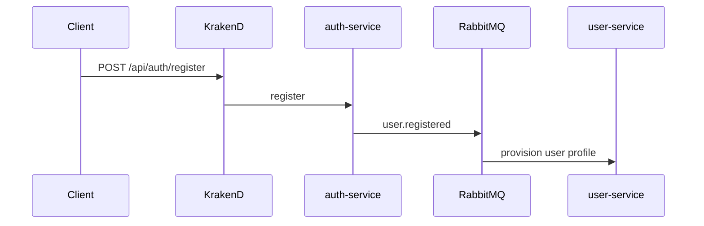

# auth-service — Overview

## Назначение

`auth-service` отвечает за **идентификацию и выдачу токенов**: регистрация, вход, обновление access token, logout. Является источником JWT и JWKS для KrakenD.

## Зона ответственности

- Регистрация пользователя (`auth_accounts`)
- Аутентификация по email/password
- Генерация access (JWT) и refresh токенов
- Публикация события `user.registered` в RabbitMQ
- Публикация JWKS для валидации токенов на gateway

**Не входит:** профили, друзья, посты, уведомления (делегируется другим сервисам после регистрации).

## Зависимости

| Тип | Компонент |
|-----|-----------|
| БД | PostgreSQL `auth_db` (Prisma) |
| Broker | RabbitMQ, exchange `user.events` |
| Внешние | Нет HTTP-зависимостей от других сервисов |

## Связи с другими сервисами

## Основные модули

| Путь | Роль |
|------|------|
| `src/routes/auth/auth.service.ts` | Бизнес-логика auth |
| `src/routes/auth/endpoints.ts` | HTTP routes |
| `src/middleware/event-bus.ts` | Публикация в RabbitMQ |
| `src/middleware/error-handler.ts` | Маппинг auth-ошибок |
| `src/config/env.ts` | Конфигурация |

## API (базовый префикс `/api/auth`)

| Метод | Путь | Описание |
|-------|------|----------|
| POST | `/register` | Регистрация |
| POST | `/login` | Вход |
| POST | `/refresh` | Обновление токенов |
| POST | `/logout` | Инвалидация refresh token |
| GET | `/jwks` | Ключи для KrakenD |

## Порт и имя

- По умолчанию: `3001`
- `SERVICE_NAME=social-auth-service`
