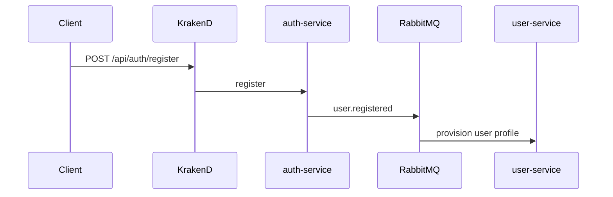

# auth-service — Overview

## Назначение

`auth-service` отвечает за **идентификацию и выдачу токенов**: регистрация, вход, обновление access token, logout. Является источником JWT и JWKS для KrakenD.

## Зона ответственности

- Регистрация пользователя (`auth_accounts`)
- Аутентификация по email/password
- Генерация access (JWT) и refresh токенов
- Device account vault (мультиаккаунты на одном браузере)
- На login: revoke orphan refresh tokens (не vault); hourly purge expired tokens
- Rate limits login/register/refresh (Redis store при `REDIS_URL`)
- Публикация события `user.registered` в RabbitMQ
- Публикация JWKS для валидации токенов на gateway

**Не входит:** профили, друзья, посты, уведомления (делегируется другим сервисам после регистрации).

## Зависимости

| Тип | Компонент |
|-----|-----------|
| БД | PostgreSQL `auth_db` (Prisma) |
| Broker | RabbitMQ, exchange `user.events` |
| Внешние | Нет HTTP-зависимостей от других сервисов |

## Связи с другими сервисами

## Основные модули

| Путь | Роль |
|------|------|
| `src/routes/auth/auth.service.ts` | Бизнес-логика auth + vault |
| `src/routes/auth/endpoints.ts` | HTTP routes |
| `src/middleware/cookie-options.ts` | refreshToken + accountSession cookies |
| `src/middleware/event-bus.ts` | Публикация в RabbitMQ |
| `src/middleware/error-handler.ts` | Маппинг auth-ошибок |
| `src/config/env.ts` | Конфигурация |

## API (базовый префикс `/api/auth`)

| Метод | Путь | Описание |
|-------|------|----------|
| POST | `/register` | Регистрация |
| POST | `/login` | Вход |
| POST | `/refresh` | Обновление токенов |
| POST | `/logout` | Инвалидация refresh; auto-switch если vault не пуст |
| GET | `/accounts` | Список аккаунтов device vault |
| POST | `/accounts/add` | Добавить аккаунт в vault |
| POST | `/accounts/switch` | Переключить активный аккаунт |
| GET | `/jwks` | Ключи для KrakenD |

## Multi-account vault

- Cookie `refreshToken` — активная сессия (как раньше).
- Cookie `accountSession` — id device vault (появляется после первого `accounts/add`).
- Таблицы `device_sessions` + `device_session_accounts` связывают несколько parked refresh-записей с одним устройством.
- Переключение ротирует refresh целевого аккаунта без повторного ввода пароля.

## Порт и имя

- По умолчанию: `3001`
- `SERVICE_NAME=social-auth-service`
