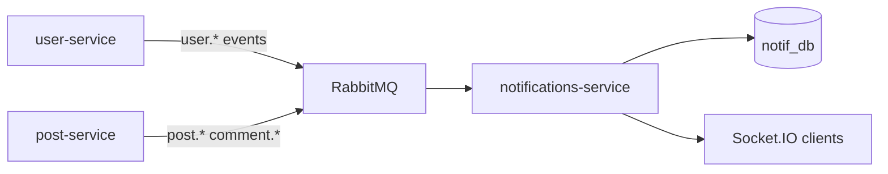

# notifications-service — Overview

## Назначение

`notifications-service` — **уведомления и realtime**: хранение in-app notifications, доставка через Socket.IO, реакция на события user/post доменов.

## Зона ответственности

- REST API: список уведомлений, mark read / read all
- Персистентность в `notifications` table
- Consumers RabbitMQ (user + post events)
- Realtime push через Socket.IO (`socket-hub`)
- Маппинг типов уведомлений в SSE-события (`sse-event-mapper`)

## Зависимости

| Тип | Компонент |
|-----|-----------|
| БД | PostgreSQL `notif_db` (Prisma) |
| Broker | RabbitMQ (`user.events`, `post.events`) |
| HTTP | user-service (аудитория постов, опционально) |
| Realtime | Socket.IO |

## Связи

## API

Префикс `/api/notifications`:

- `GET /` — список (`?unreadOnly=true`)
- `PATCH /:id/read` — прочитать одно
- `PATCH /read-all` — прочитать все

## Порт

- По умолчанию: `3005`
- `SERVICE_NAME=social-notifications-service`
