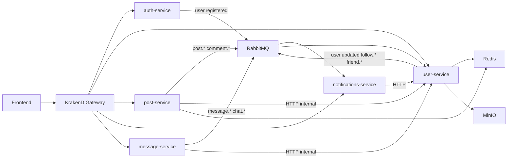

# Архитектурные принципы

Документ описывает целевую архитектуру `social-backend-service` на основе фактической реализации в репозитории.

## Технологический стек

| Слой | Технология |
|------|------------|
| Runtime | Node.js 18+ |
| Язык | TypeScript |
| HTTP | Express 5 |
| ORM | Prisma + PostgreSQL (`@prisma/adapter-pg`, `pg`) |
| API Gateway | KrakenD |
| Message Broker | RabbitMQ (`amqplib`) |
| Cache | Redis (`redis`) |
| Object Storage | MinIO / S3-compatible (AWS SDK v3) |
| Realtime | Socket.IO (notifications-service) |
| Оркестрация | Docker Compose |

## Микросервисы и зоны ответственности

| Сервис | Ответственность | База данных |
|--------|-----------------|-------------|
| `auth-service` | Регистрация, login, JWT/JWKS, refresh/logout | `auth_db` |
| `user-service` | Профили, друзья, подписки, смена пароля, provisioning | `user_db` + доступ к `auth_db` (password) |
| `post-service` | Посты, комментарии, лайки, лента | `post_db` |
| `notifications-service` | Хранение уведомлений, realtime (Socket.IO), consumers | `notif_db` |
| `message-service` | Личные чаты и сообщения, события `message.events` | `msg_db` |

**Правило границ:** каждый сервис владеет своей схемой БД. Кросс-сервисные данные передаются через HTTP (internal API) или события RabbitMQ, а не через прямой доступ к чужой БД (исключение: `user-service` читает/пишет `auth_db` только для password flow).

## Высокоуровневая схема



## Паттерны взаимодействия

### Синхронное (HTTP)

- Внешний трафик идёт только через **KrakenD** (`krakend/krakend.tmpl`).
- Защищённые downstream-эндпоинты получают identity через заголовки:
  - `x-user-id`
  - `x-user-role` (опционально)
- Сервис-сервис вызовы: `post-service` / `message-service` → `user-service` (`/api/users/internal/*`) для авторов.

### Асинхронное (RabbitMQ)

| Exchange (env) | Publisher | Consumer |
|----------------|-----------|----------|
| `user.events` | auth-service, user-service | user-service, notifications-service |
| `post.events` | post-service | notifications-service |
| `message.events` | message-service | notifications-service |

Типичные routing keys: `user.registered`, `user.updated`, `follow.created`, `friend.requested`, `post.created`, `comment.created`, `post.liked`, `message.created`, `chat.created`, `chat.deleted`.

### Кэш (Redis)

Используется в `post-service` (кэш постов/лент) и `user-service` (профили, списки, relation flags). Инвалидация — по pattern delete при мутациях.

## Структура сервиса (эталон)

```
services/<name>/
  src/
    config/       # env, database, health, lifecycle
    middleware/   # error-handler, krakend-auth, event-bus, redis
    routes/       # endpoints + *.service.ts (бизнес-логика)
    consumers/    # RabbitMQ consumers (если есть)
    clients/      # HTTP-клиенты к другим сервисам
    index.ts      # bootstrap
  prisma/
  tests/
  Dockerfile
  .env.example
```

`message-service` пока не следует полному шаблону — см. рекомендации в `Agent.md`.

## Надёжность и эксплуатация

### Health checks

Стандарт: `GET /health` → `{ status, service, database? }`. В `auth`, `user`, `post`, `notifications` — проверка БД через `createHealthHandler`. В `message-service` — упрощённый ответ без проверки БД в payload.

### Graceful shutdown

`registerShutdown(server, tasks)` на `SIGTERM`/`SIGINT`: отключение event bus, закрытие Prisma/pool. Обязательно для production-ready сервисов.

### Подключение к RabbitMQ

Retry с экспоненциальной задержкой (`RABBITMQ_CONNECT_MAX_ATTEMPTS`, `RABBITMQ_CONNECT_RETRY_DELAY_MS`). Ошибки подключения часто только логируются — сервис продолжает принимать HTTP (осознанный trade-off; при критичности событий рассмотреть fail-fast).

### Идемпотентность

- Consumers должны быть устойчивы к повторной доставке (at-least-once).
- Мутации с гонками (например `toggleLike`) — транзакции + уникальные индексы.

## Безопасность (архитектурный уровень)

### Сетевая изоляция (Docker)

- `edge-net`: KrakenD (`:8080`), временно MinIO (`:9000`) и notifications WebSocket (`:3005`).
- `backend-net` (`internal: true`): микросервисы, БД, Redis, RabbitMQ — без проброса портов на host.
- KrakenD и notifications подключены к обеим сетям.

### User context

- JWT валидируется на **KrakenD** и **повторно в downstream** (`userContextMiddleware` из `shared/security`).
- Заголовок `x-user-id` не является доверенным: при несовпадении с JWT запрос отклоняется.

### Service-to-service

- Internal API защищён Service JWT (`POST /api/auth/internal/token`).
- Credentials: `SERVICE_CLIENT_*_ID` / `SERVICE_CLIENT_*_SECRET` в `.env`.
- Альтернатива для production: mTLS (Phase 2) — см. план hardening.

### Прочее

- `auth-service` публикует JWKS для gateway.
- Секреты только через env (`.env.example` как контракт).
- RabbitMQ consumers не затрагиваются HTTP-auth правилами.

## Миграция security boundary

1. Заполнить `SERVICE_CLIENT_*_SECRET` в корневом `.env`.
2. `docker compose up --build` — проверить healthchecks и KrakenD.
3. Убедиться, что `INTERNAL_API_AUTH_ENABLED=true` (по умолчанию).
4. REST-клиенты без изменений (уже шлют `Authorization` через gateway).
5. Phase 2: единый BFF для WS/MinIO; опционально mTLS.

## Что не входит в репозиторий

- Единый npm workspace для middleware; вместо этого — канонический модуль `shared/security` (копируется в сервисы при `prebuild`).
- Единый OpenAPI-спек на весь API (маршруты описаны в KrakenD template).
- CI/CD pipelines (`.github/workflows` отсутствует).
